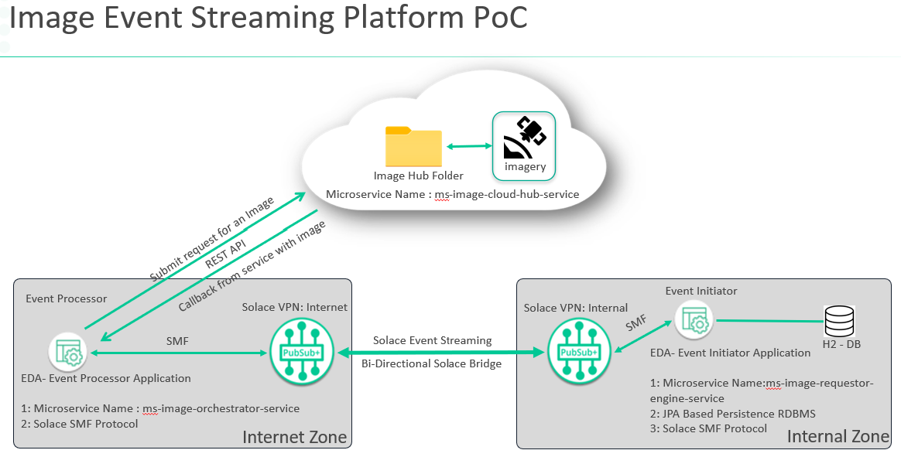
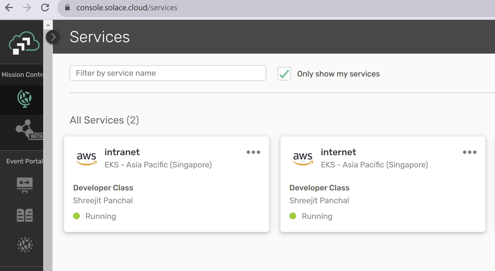
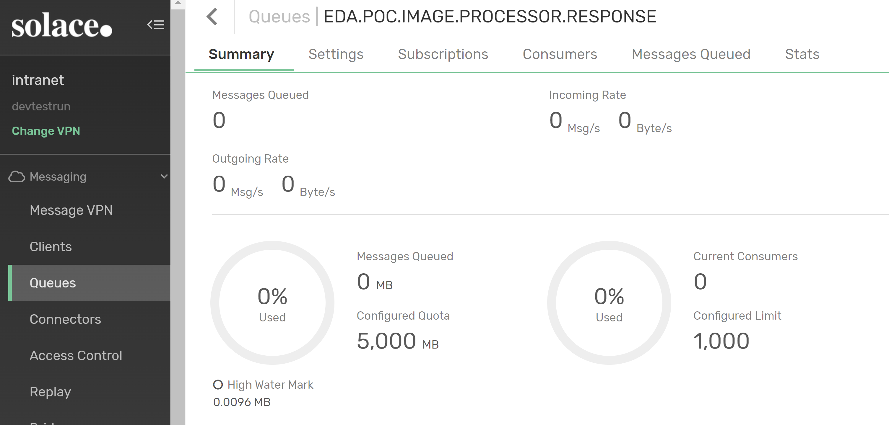
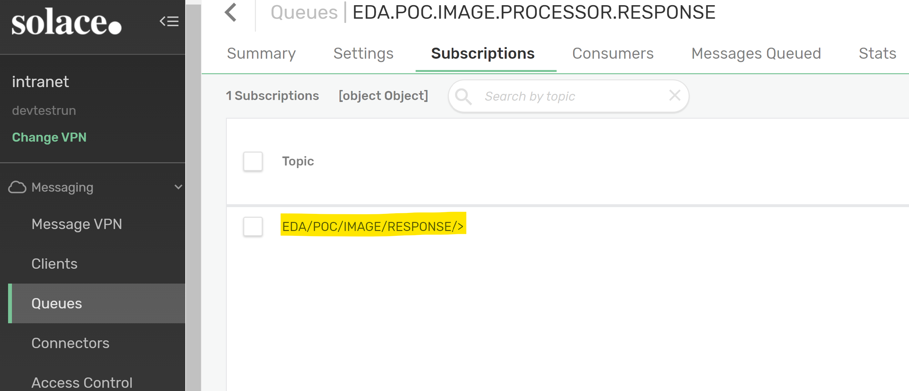
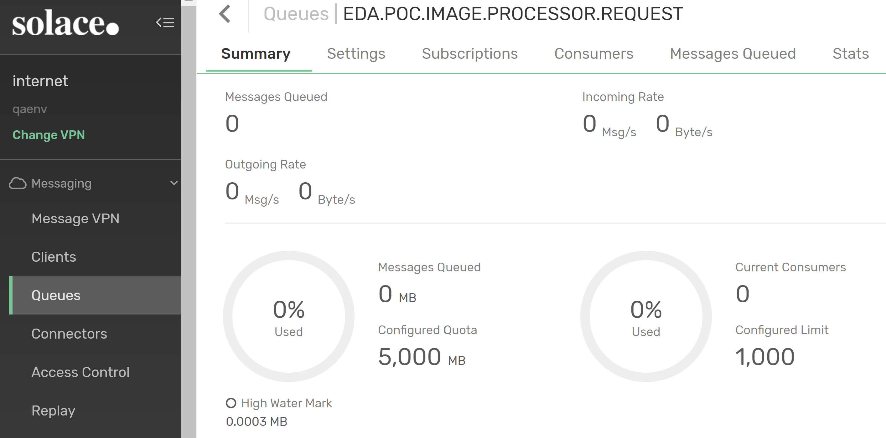
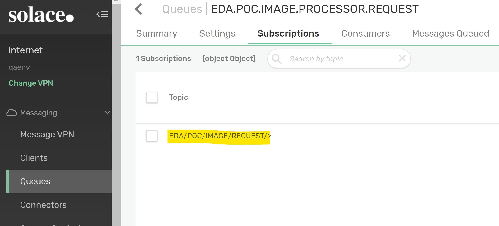
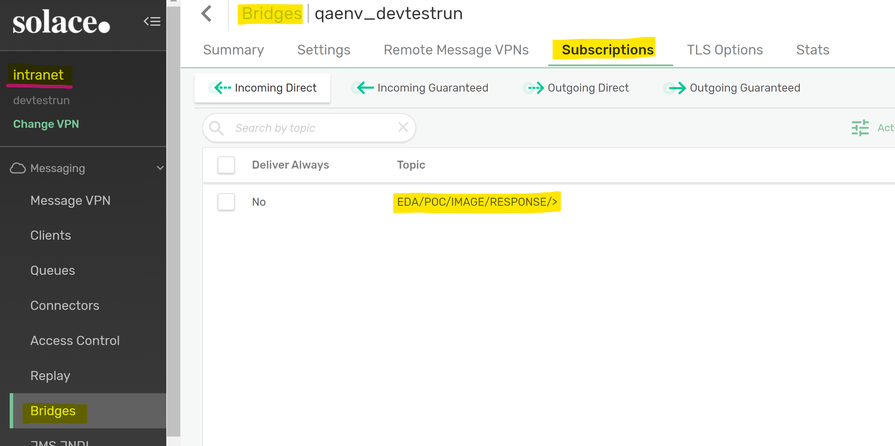

## Solace PubSub+ based Spring based Simulator POC for Image download from remote server

## Author : Shreejit Panchal

## Access a PubSub+ Service
The Spring Tutorials require that you have access to a PubSub+ Service. You can quickly set one up for FREE by following [these instructions](https://solace.com/try-it-now/)

--- Simulator Architecture ---

--- Follow below steps to provision Solace PubSub+ Cloud Services for this Simulator

-- Step 1: Create 2 Solace services with name Intranet and Internet as below:

-- Step 2: Configure and create Queue EDA.POC.IMAGE.PROCESSOR.RESPONSE in Intranet Solace services via PubSub+ Broker Manager UI:

-- Step 3: Configure Topic Subscription as below to Queue EDA.POC.IMAGE.PROCESSOR.RESPONSE in Intranet Solace services via PubSub+ Broker Manager UI:

-- Step 4: Configure and create Queue EDA.POC.IMAGE.PROCESSOR.REQUEST in Internet Solace services via PubSub+ Broker Manager UI:

-- Step 5: Configure Topic Subscription as below to Queue EDA.POC.IMAGE.PROCESSOR.REQUEST in Internet Solace services via PubSub+ Broker Manager UI:

-- Step 6: Configure Bridge between Intranet and Internet service and add Bridge Subscription to individual service as below:

