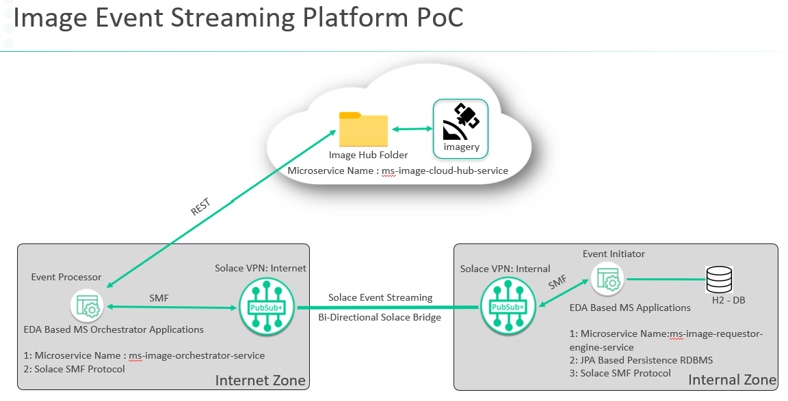

## Solace PubSub+ based Spring based Simulator POC for Image download from remote server

## Author : Shreejit Panchal

## Access a PubSub+ Service
The Spring Tutorials require that you have access to a PubSub+ Service. You can quickly set one up for FREE by following [these instructions](https://solace.com/try-it-now/)

--- Simulator Architecture ---
